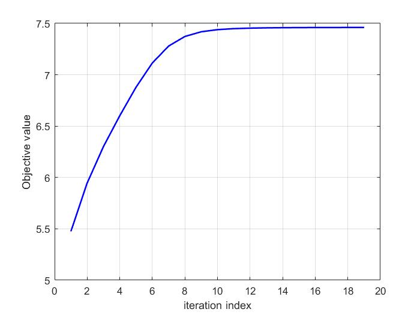

# Fractional Programming for SWIPT Beamforming

MATLAB/CVX examples for maximizing the downlink sum rate in a multi-user simultaneous wireless information and power transfer (SWIPT) system. The project applies an iterative **quadratic transform** to turn the non-convex sum-of-log-SINR objective into a sequence of convex CVX subproblems.



## Requirements

- MATLAB
- [CVX](http://cvxr.com/cvx/) installed and initialized with `cvx_setup`
- A CVX-compatible solver

## Project contents

| File | Description |
| --- | --- |
| `sum_rate_maximization_SWIPT.m` | Two-user SWIPT sum-rate maximization with a transmit-norm constraint and a linearized energy-harvesting constraint. |
| `sum_rate_maximization_SWIPT_V2.m` | Variant with one additional dedicated energy beam, resulting in a `(K + 1)`-column beamforming matrix. |
| `quadratic_transform_sum_rate.m` | Baseline two-user sum-rate maximization without the energy-harvesting constraint. It also includes an optional, computationally expensive Monte-Carlo comparison. |
| `quadratic_transform.m` | Small scalar example of the quadratic-transform update on `x / (x^2 + 1)`. |
| `convergence.jpg`, `convergence.fig` | Example convergence plot in image and MATLAB figure formats. |

## Quick start

Open MATLAB, set this directory as the current folder, and run one of the following scripts:

```matlab
sum_rate_maximization_SWIPT
```

```matlab
sum_rate_maximization_SWIPT_V2
```

```matlab
quadratic_transform_sum_rate
```

For a minimal demonstration of the fractional-programming update, run:

```matlab
quadratic_transform
```

The scripts use `rng(0)` where reproducibility is needed, so repeated runs use the same randomly generated channels.

## System model

The examples use a downlink system with:

- `Nt = 6` transmit antennas;
- `K = 2` information users;
- a complex channel matrix `H` from the base station to the information users;
- an energy-device channel `he`;
- additive noise power `sigma = 1`.

Let \(\mathbf W=[\mathbf w_1,\ldots,\mathbf w_K]\) denote the beamforming matrix. The rate of user \(k\) is evaluated as

\[
R_k=\log_2\!\left(1+
\frac{|\mathbf h_k^H\mathbf w_k|^2}
{\sum_{j\ne k}|\mathbf h_k^H\mathbf w_j|^2+\sigma}\right).
\]

The goal is to maximize \(\sum_k R_k\), subject to the constraints in each script.

## Algorithm: quadratic transform with alternating optimization

Direct sum-rate maximization is non-convex because of the SINR ratios. Each iteration uses auxiliary variables `mu` and `v`:

1. Update `mu(k)` and `v(k)` from the current beamformers `W(:,:,iter)`.
2. Hold those auxiliary variables fixed.
3. Use CVX to optimize the next beamforming matrix `W0`.
4. Evaluate the original sum rate and stop when the change is below `delta` or when `iter_num` is reached.

The CVX objective is a concave surrogate of the transformed sum-rate objective, so the beamforming step is convex once `mu` and `v` are fixed.

## SWIPT energy-harvesting constraint

The SWIPT scripts include an energy-efficiency factor and a harvested-energy threshold:

```matlab
eta = 0.8;
Emax = 8;
```

The received-energy expression is non-convex in the beamforming variables. The code uses the previous iterate `W(:,:,iter)` to construct a first-order lower bound, then requires that lower bound to be at least `Emax`:

```matlab
eta * (norm(he' * W(:,:,iter))^2 + sigma + ...
    real(trace(2 * W(:,:,iter)' * (he * he') * ...
    (W0 - W(:,:,iter))))) >= Emax
```

## Difference between the two SWIPT scripts

`sum_rate_maximization_SWIPT.m` uses `K` transmit beams: one information beam per user.

`sum_rate_maximization_SWIPT_V2.m` uses `K + 1` transmit beams. The extra column can act as a dedicated energy beam, but it also appears as interference in each information user's SINR denominator.

## Key parameters

| Parameter | Default | Meaning |
| --- | ---: | --- |
| `Nt` | `6` | Number of transmit antennas. |
| `K` | `2` | Number of information users. |
| `iter_num` | `100` | Maximum number of alternating-optimization iterations. |
| `Pmax` | `2` or `3` | Upper bound used in `norm(W0) <= Pmax`. |
| `sigma` | `1` | Receiver noise power. |
| `eta` | `0.8` | Energy-harvesting efficiency. |
| `Emax` | `8` | Minimum harvested-energy target. |
| `delta` | `1e-4` | Sum-rate convergence tolerance. |

## Notes

- For a matrix, MATLAB/CVX interprets `norm(W0)` as the matrix 2-norm (largest singular value), not total transmit power. If `Pmax` is intended to represent total power, use a squared Frobenius-norm constraint such as `square_pos(norm(W0, 'fro')) <= Pmax`.
- `quadratic_transform_sum_rate.m` contains a Monte-Carlo loop with `MentCarlo_num = 1e6`. It can run slowly; comment out that section when only the optimization result is needed.
- The channel coefficients are generated randomly for demonstration. Replace `H` and `he` with measured or simulated channel data for a specific scenario.
- The implementation is intended as an instructional fractional-programming example. A full research simulation should additionally check feasibility, initialization sensitivity, and convergence across multiple channel realizations.
# Fractional-Programming-for-SWIPT-Beamforming
